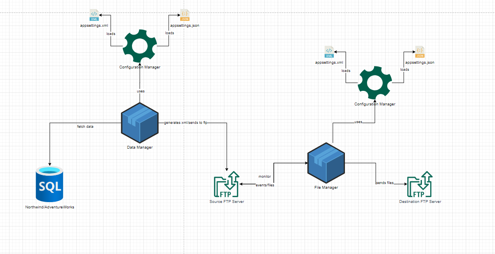

# Лабораторная работа №4
Схема того, как это всё дело работает: 

Папки для просмотра:
- Lab3(папка, в которой содержится результат третьей лабораторной работы(шифрование,архивирование,перемещение,деархивирование,дешифрование и сохранение архива файла)).
- DatabaseManager(сервис для работы с БД).
- DatabaseModels(папка с сущностями).
- DataAccessLayer(слой работы с базой данных, с помощью которого можно взаимодействовать с базой данных и хранить модели, описывающие используемые сущности).
- ServiceLayer(слой для работы DataAccessLayer).
- ConfigurationManager(код, с помощью которого получаем необходимые конфигурационные свойства из Xml и Json файла).

Как это работает:

Point.
